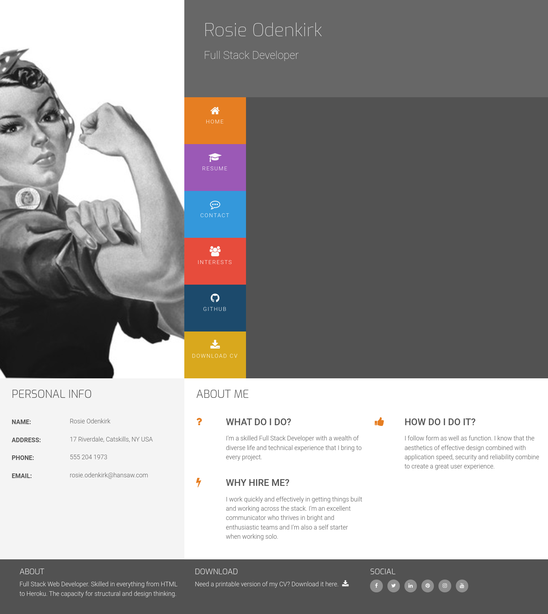
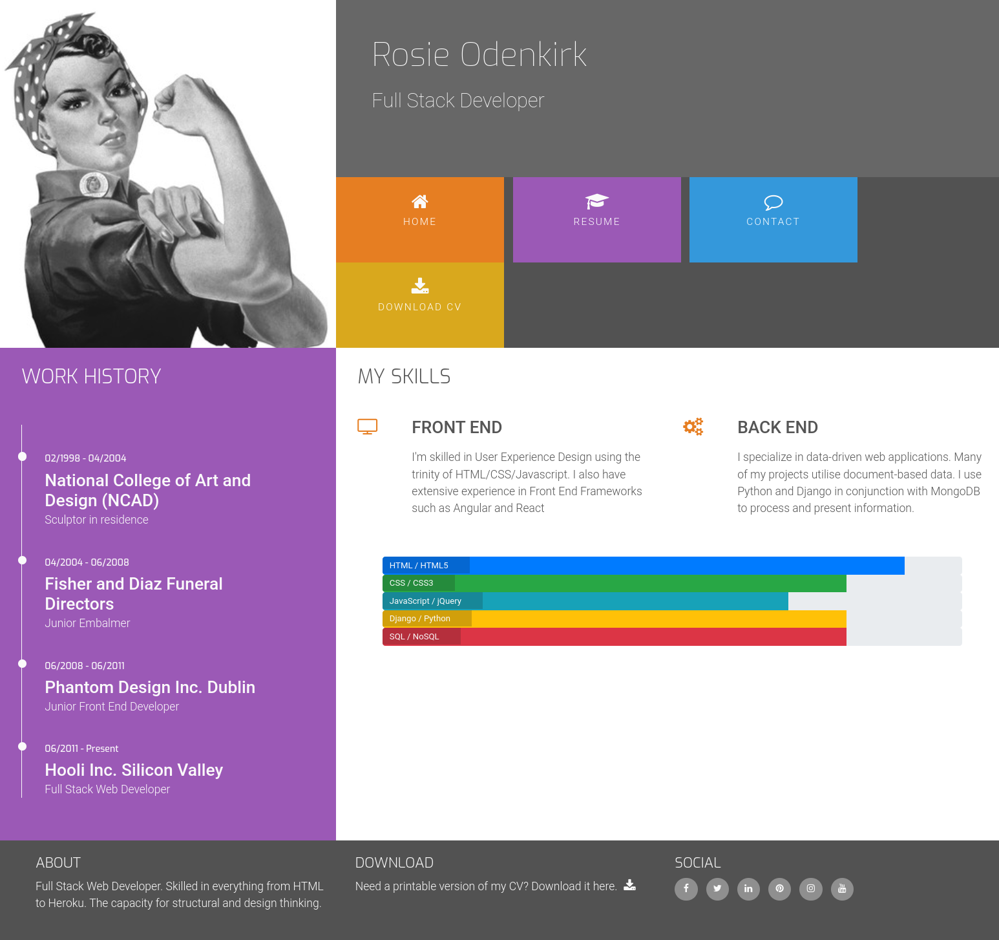
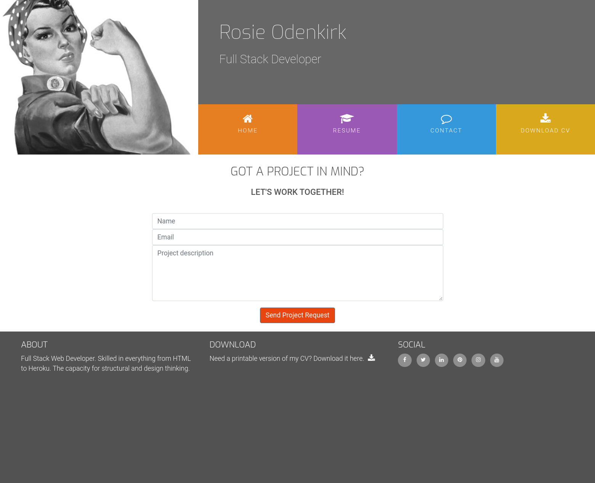
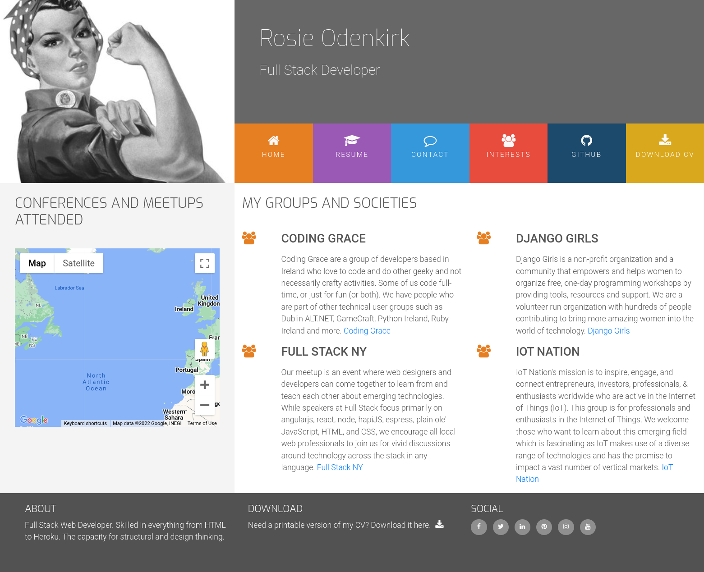
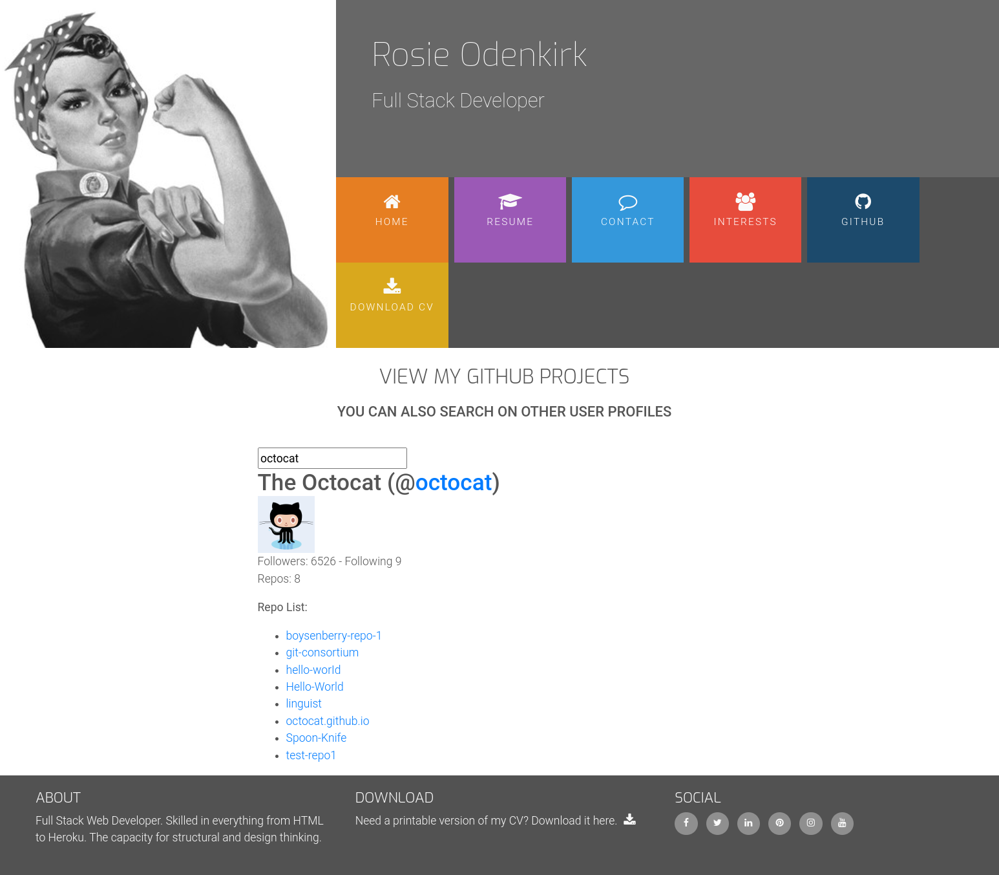

# Rosie's Resume

Fictional Full Stack Developer resume page. It contains home page, resume page, contact page, interests page, GitHub page and download CV link. App is fully responsive and uses multiple API's.

Clicking on the resume page will open a work history on the left hand side, displayed as a timeline, and the skill sets on the right.
There are also progress bars where Rosie has given a rating of her skills in different areas.

Contact page have three fields: two text fields and a text area where project ideas can be submitted.
Contact page is wired to JavaScript email API.

Interests page contains short description of groups and societies with a map that uses a Google Maps API

GitHub page provides the search option that leverages API to search for GitHub users and lists their repositories.

There is also an option of downloading a CV for employers who want a more traditional representation of a resume.

# Technologies used
* HTML5
* Bootstrap 4
* JavaScript
* Email.js API
* GitHub API
* Google Maps API

# Site functionality

## Home page
* Site navigation
* Personal info
* About
* Social links

## Resume page
* Work history timeline
* Skills 
* CV download link at the bottom (.pdf file)

## Contact page
* contact form containing
    * Name
    * Email 
    * Project description
* Wired to Email.js API

## Interests page
* Info on Rosie's groups with links
* Map of conferences and meetups attended wired to Google Maps API

## GitHub page
* List of Rosie's project
* wired to GitHub API
* Can also search GitHub users and show a list of their repositories
* Implemented API rate limiting

## Download CV
* Direct link to download a pdf

# Screenshots
Home

Resume

Contact

Interests

GitHub

# Demo 

You can see the demo app here:

https://azelliott.github.io/resume-bootstrap4/index.html

# Deployment

To deploy locally, clone the repository with:

`git clone https://github.com/Azelliott/resume-bootstrap4`